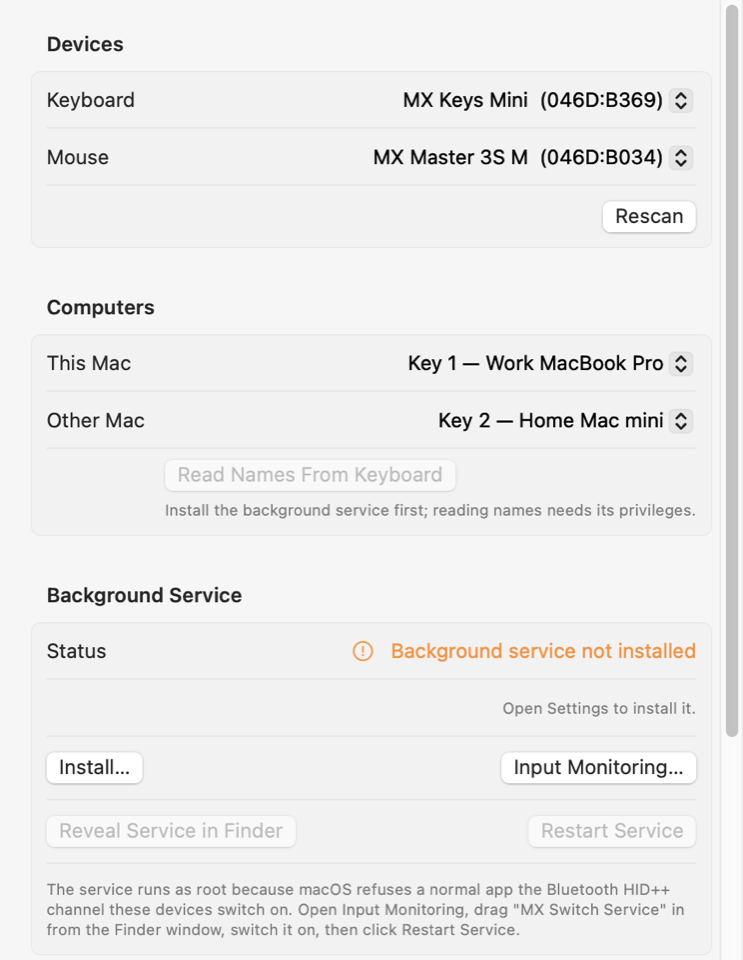

# Logitech MX Switch

A macOS menu bar app that makes the Easy-Switch keys on an MX keyboard move the
mouse too. Press key 1 or key 2 and both devices land on the same Mac. No
Logitech software, no network between the machines, no Flow.



Built on the HID++ research in
[omar16100/logi_mx_auto_switch](https://github.com/omar16100/logi_mx_auto_switch).
The protocol work is theirs. The app, the native IOKit transport and the setup
flow are new.

## The problem

Easy-Switch moves the keyboard and nothing else. The mouse has its own button on
the underside. Two devices, two presses, on two different pieces of plastic.

## How it works

Every Mac runs its own copy, and a copy only ever pushes the mouse **away** from
the machine it runs on.

1. Poll HID enumeration for the keyboard once a second. This needs no privileges.
2. The keyboard vanishing for two consecutive polls means Easy-Switch was pressed.
3. Open the mouse's HID++ vendor interface and send ChangeHost `setCurrentHost`
   (feature `0x1814`) for the other Mac's slot.
4. Confirm it worked by watching the mouse leave this Mac's enumeration.

On a two-Mac setup you install on both and tell each one which key the *other*
machine sits on. Easy-Switch then carries the mouse in both directions.

| Machine | Its Easy-Switch key | Sends the mouse to |
|---|---|---|
| Work MacBook Pro | 1 | key 2 |
| Home Mac mini | 2 | key 1 |
| anything on key 3 | 3 | not installed, ignored |

Two guards keep it from firing when it should not. A wall-clock jump larger than
five poll intervals means the Mac slept, so the state resynchronises without
switching. A transport failure counts as "unknown" rather than "keyboard absent",
so a Bluetooth hiccup cannot trigger a switch by itself.

## Requirements

- macOS 13 or later, Apple Silicon or Intel
- An MX keyboard and mouse paired over Bluetooth, both supporting HID++ ChangeHost
- Administrator access once, to install the background service

Developed against MX Keys Mini (`046D:B369`) and MX Master 3S (`046D:B034`), both
BLE-direct. Other MX models work the same way. Product ids are read from the
hardware rather than hardcoded, and only devices that actually expose the HID++
vendor interface are offered in the pickers.

## Install

```bash
git clone git@github.com:piotrbernad/LogitechMXSwitcher.git
cd LogitechMXSwitcher
make install
```

That builds `MX Switch.app`, copies it to `/Applications` and launches it. Then,
in the window that opens:

1. Check the **Keyboard** and **Mouse** pickers. They are filled in already if
   your devices are paired.
2. Click **Install…** under Background Service and approve the admin prompt.
3. Click **Input Monitoring…**. That opens the System Settings pane and a Finder
   window holding **MX Switch Service**. Drag it into the list and switch it on.
4. Click **Restart Service**, so the new grant takes effect. macOS caches a
   permission decision for the life of a process, so the service has to be a new one.
5. Click **Read Names From Keyboard**. The keyboard reports each Easy-Switch
   slot's Bluetooth name, so **This Mac** and **Other Mac** fill themselves in
   with real machine names instead of bare numbers.

Repeat on the second Mac, where **Other Mac** is the first machine's key.

### Why it needs root and Input Monitoring

Opening the Bluetooth HID++ vendor interface returns `kIOReturnNotPermitted`
(`0xE00002E2`) to an ordinary user process, and it returns the same thing to root
without an Input Monitoring grant. Both are required. The watcher therefore
installs as a root LaunchDaemon and the menu bar app stays unprivileged.

The service installs as a named bundle at
`/Library/PrivilegedHelperTools/MX Switch Service.app` rather than a bare Unix
binary, because Input Monitoring lists whatever asked for access. A bundle appears
there under a name you can recognise, and it can be dragged in from the Finder.

The two halves exchange three JSON files in `~/Library/Application Support/MXSwitch`.
The app owns `config.json`, the daemon owns `status.json`, and `command.json`
carries one-shot requests tagged with a monotonic id, so re-reading it is a no-op.
Anything the daemon writes into that directory is chowned back to you.

Everything the installer runs as root can be read first:

```bash
"/Applications/MX Switch.app/Contents/MacOS/MXSwitch" --print-install-script
```

## Using it

The menu bar item shows what the daemon is doing and what it will do next. It
also offers **Switch Keyboard and Mouse to …**, which moves both devices from the
Mac you are sitting at, for when you want to leave without reaching for the
keyboard. Hold ⌥ for a mouse-only push.

## Uninstall

```bash
make uninstall
```

Removes the app, the LaunchDaemon and the helper bundle. Delete
`~/Library/Application Support/MXSwitch` to drop the settings too, and remove the
Input Monitoring entry by hand.

## Development

```bash
make test      # 55 assertions over the pure logic, no hardware needed
make lint      # shell scripts must parse and stay pure ASCII
make devices   # every HID device and collection this Mac can see
make build     # builds dist/MX Switch.app and runs lint plus the tests
```

`make lint` is not decoration. Under a UTF-8 locale bash reads a multibyte
character next to an expansion as part of the variable name, so `"$app..."`
written with a typographic ellipsis becomes an unbound variable and `set -u`
kills the build. A C locale hides it completely, so the check is the only thing
that catches it reliably.

Tests are a plain executable rather than an XCTest bundle, because XCTest ships
with Xcode while this project also builds against the Command Line Tools alone.
`Scripts/build.sh` picks whichever toolchain is present.

The service binary doubles as a troubleshooting CLI:

```bash
helper="/Library/PrivilegedHelperTools/MX Switch Service.app/Contents/MacOS/MXSwitchService"
"$helper" devices --verbose                 # no privileges needed
sudo "$helper" probe --device 046D:B369     # read the Easy-Switch slot names
```

### Layout

```
Sources/MXSwitchKit/     model, HID++ codec, IOKit transport, watcher, push sequence
Sources/mxswitchd/       the root LaunchDaemon and its CLI subcommands
Sources/MXSwitchApp/     menu bar app, settings window, privileged installer
Sources/mxswitch-tests/  offline assertions over the pure logic
Scripts/build.sh         assembles and ad-hoc signs the app and its helper
```

`MXSwitchKit` separates hardware from logic deliberately. `HIDPP.swift` and
`PresenceWatcher.swift` contain no IOKit and no clock, which is what lets them be
tested against byte captures taken from real devices.

macOS reports a Bluetooth device as a single `IOHIDDevice` and hides its extra
top-level collections in `DeviceUsagePairs`, so the HID++ interface is found
there rather than through `PrimaryUsagePage`. Matching on primary usage silently
finds nothing. `make devices` prints the collections if you need to check.

## Troubleshooting

**"Needs Input Monitoring"** after granting it. The grant is keyed to the
signature of the binary, so a rebuild invalidates it. Remove the stale entry, add
the new one, and click Restart Service.

**The keyboard switches but the mouse stays behind.** Almost always the other Mac
does not have MX Switch installed. A copy can only push the mouse *away* from
itself, so with one install the mouse leaves once and nothing can send it back.
Install on both Macs. The log says
`is not connected to this Mac, so it cannot be moved from here` when this is what
happened.

**Nothing happens on Easy-Switch.** Read
`~/Library/Application Support/MXSwitch/mxswitchd.log`. "did not move after N
attempts" means the mouse never confirmed its departure. "the Mac slept
mid-switch" means the sleep guard fired and declined to act on a stale trigger.
Crashes land in `/Library/Logs/DiagnosticReports/MXSwitchService-*.ips`, and
repeated `mxswitchd started` lines in the log mean launchd is restarting it.

**The mouse went to a slot with nothing on it.** Set **Other Mac** to a key that
is actually paired. The mouse reports three slots whether or not they are in use,
so an unpaired target cannot be rejected in advance. Press the button underneath
the mouse to bring it back.

**An unexpected app appears in Input Monitoring.** macOS attributes a permission
request to the responsible process, which for anything launched from a terminal
is that terminal's app. Only **MX Switch Service** needs the grant.

## Credits

Technique and HID++ reference from
[omar16100/logi_mx_auto_switch](https://github.com/omar16100/logi_mx_auto_switch),
itself a port of
[aguessous/Logitech-MX-Auto-Switch](https://github.com/aguessous/Logitech-MX-Auto-Switch).
HID++ 2.0 details cross-checked against
[Solaar](https://github.com/pwr-Solaar/Solaar). MIT licensed.
